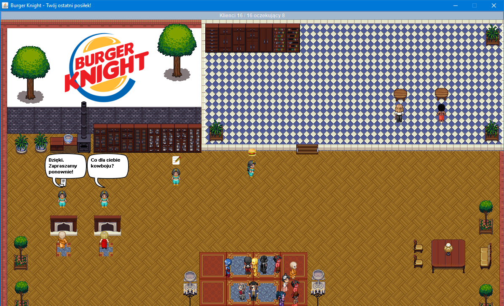

# BurgerKnight
## Opis projektu  
Projekt restauracji zakładający synchronizację dwóch typów wątków, kelnerów, oraz klientów. Logika każdego klienta oraz kelnera obsługiwana jest w osobnym wątku. Klienci wchodzą do restauracji i zajmują pierwszy wolny z czterech dostępnych stolików, umieszczonych w dwóch salach po dwa stoliki. Jeżeli klient wybierze stolik w sali bocznej, ustawia się we wspólnej kolejce klientów i kelnerów, do przejścia przez drzwi. Przechodzi pierwszy wątek który zatrzymał się przy drzwiach, jeśli zatrzymało się więcej niż jeden wątków, przechodzą w kolejności, w której dotarli do drzwi.  Jeżeli wszystkie stoliki są zajęte, wątek klienta jest usypiany metodą wait(). Gdy klient podejdzie do stolika, czeka na przyjście kelnera, po czym składa zamówienie. Kelner idzie do kuchni, wraca z zamówieniem do stolika, klient przez kilka sekund je posiłek, kelner w tym czasie wraca do kuchni po paragon, przynosi paragon do stolika klient płaci i wychodzi, kelner wraca z gotówką do kuchni. Maksymalna póla wątków to 20, realizowane przez ExecutorSevice. 4 wątki obsługują kelnerów, pozostałe 16 kilentów. Nowe zadanie klienta dodawane jest poprzez kliknięcie w głowny panel programu, zadania są kolejkowane, ich aktualny stan wyświetla się na pasku postępu w górnej części okna, gdzie wyświetlana jest liczba wykonywanych wątków klienta, oraz (jeśli istnieje), kolejka zadań klienta czekających na wykonanie. Każdy wątek aktualizuje swoją logikę 60 razy na sekundę, natomiast grafika renderowana jest w pętli gównej programu. Animacje poruszania wykonywane są przez wspólny TimerTask, klatka animacji trwa 200ms.  
  
**Obiekt Main**  
Głowny panel programu (JPanel), na którym renderowane są wszystkie sprite'y i tło. Inicjuje on także pulę Egzekutorów, tworzy wszystkie początkowe renderowane obiekty programu oraz uruchamia pętlę głowną.
  
**Obiekt Manager**  
Odpowiada za renderowanie wszystkich obiektów, które znajdują się na jego liście renderingu oraz implementują interfejs Renderable. 
  
**AppObject**  
Każdy obiekt dziedziczący po tej klasie posiada współrzędne 2D, może się poruszać, być animowany, oraz przechodzić przez drzwi.  
  
**Doors**  
Każdy obiekt drzwi zapewnia metody synchronizacji i kolejkowania przejścia przez nie.
  
**Table**  
Podobnie jak w przypadku drzwi, zapewnia metody synchronizacji klietów i kelnerów przy obiekcie stolika.

